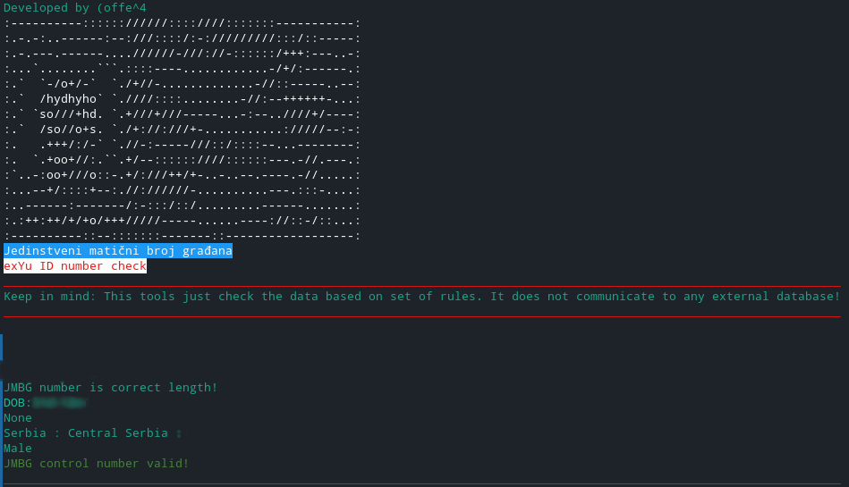

# jmbg_check_py
A simple Python CLI tool for checking JMBG numbers.




## Usage
```bash
git clone https://github.com/coffee2222/jmbg_check_py.git 
cd jmbg_check_py/
python jmbgck.py 3213990015001 (jmbg number)
```
## Multiple numbers
  To check multiple jmbg numbers we use xargs command to run based on amount of lines in a file...
  ```bash 
  xargs -l python jmbgck.py < jmbgs.txt
  ```
  The file jmbgs.txt should look like this:
  ```txt
  1212999102315
  1101995500312
  ...
  ```

  
